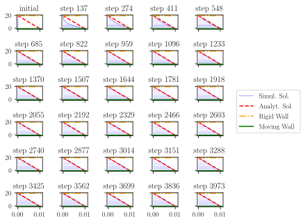
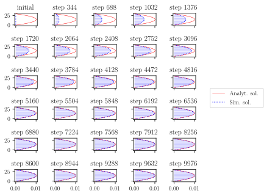

# Lattice Boltzmann Parallel Solver

## Results

### Von Karman vortex street

### Couette flow evolution

### Poiseuille flow evolution

## High-level structure
The code is organized as follows:
-  contains the report
-  contains figures from our experiments
-  contains the main part of the code
  -  implements several boundary conditions
  -  plugs specific combinations of boundary conditions together
  -  contains functions to run the experiments
  -  contains initial value specifications
  -  implements the basic ingredients of the LBM
  -  calls the experiments specified by the command arguments
  -  implements essential parts of the parallel communication
  -  contains several helper functions for visualizations
-  contains several unit tests for Travis CI

## How to build
`make init`

## How to reproduce results
- Shear wave decay
  - `python src/main.py -f "shear_wave_decay_density"`
  - `python src/main.py -f "shear_wave_decay_velocity"`
  - `python src/main.py -f "viscosity_vs_omega"`
- Couette flow
  - `python src/main.py -f "couette_vectors"`
  - `python src/main.py -f "couette_evolution"`
- Poiseuille flow
  - `python src/main.py -f "poiseuille_vectors"`
  - `python src/main.py -f "poiseuille_evolution"`
- von Karman vortex street
  - `python src/main.py -f "reynold_strouhal"`
  - `python src/main.py -f "nx_strouhal"`
  - `python src/main.py -f "blockage_strouhal"`
- scaling tests
  - `mpirun -N 4 python src/main.py -f "scaling_test"`
- pngs images to gif
  - `python src/main.py -f "pngs_to_gif"`
